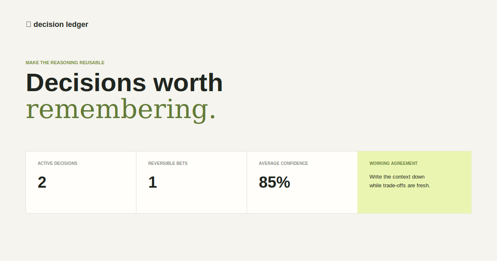

# Decision Ledger


**A calm, local-first journal for decisions that should remain explainable.**

Decision Ledger helps teams record a decision's context, confidence, reversibility, and supporting evidence—then find it again when the question comes back six weeks later.



## Features

- Capture decisions with a clear owner, confidence level, and decision type
- Separate reversible bets from hard-to-undo commitments
- Attach concise context and evidence links
- Filter by status, type, and search terms
- Keep data in the browser with `localStorage`
- Export a portable JSON archive
- Seeded examples make the app useful immediately

## Run locally

Open `index.html` in a modern browser. Or use a small local server:

```bash
python -m http.server 8080
```

Visit `http://localhost:8080`.

## How it works

1. Review the active decision queue or search the ledger.
2. Use **Record decision** to capture the decision, why it was made, and what supports it.
3. Mark it as reversible when it is safe to revisit.
4. Export the archive before a handoff or retrospective.

## Project structure

```text
decision-ledger/
├── index.html        # Product UI and dialog
├── styles.css        # Visual system and responsive layout
├── app.js            # Rendering, filters, local persistence, export
├── model.js          # Pure decision and summary helpers
├── seed.js           # Useful sample decisions
├── tests/            # Node tests for the domain model
└── assets/           # README preview image
```

## Verify

```bash
npm test
```

## Future ideas

- decision review reminders
- Markdown and CSV exports
- optional team sync with conflict-free local drafts
- links to pull requests and project tickets

## License

MIT. See [LICENSE](LICENSE).
